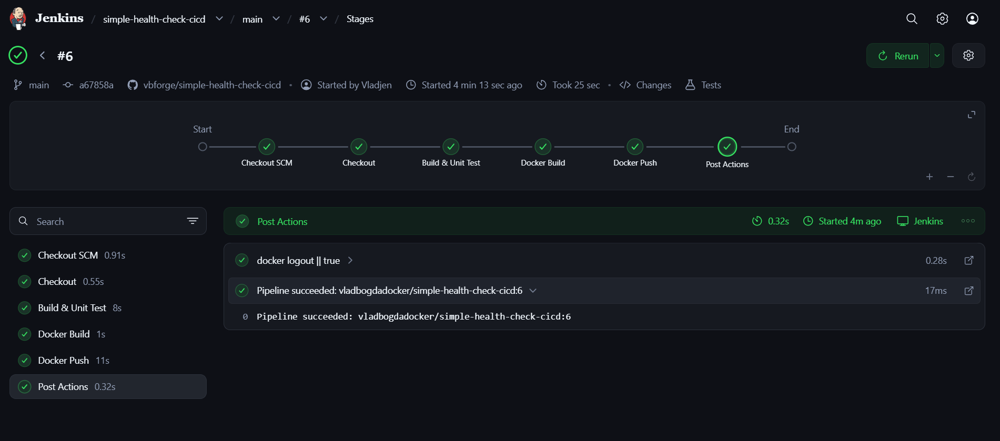

# simple-health-check-cicd

A minimal Spring Boot service built as a hands-on exercise in shipping a real CI/CD pipeline end to end: **code → GitHub → Jenkins (build, test, image, push) → Docker Hub → pullable by anyone.**

The app itself is intentionally small — the point of this project is the *pipeline*, not the business logic.

- **GitHub:** [vbforge/simple-health-check-cicd](https://github.com/vbforge/simple-health-check-cicd)
- **Docker Hub:** [vladbogdadocker/simple-health-check-cicd](https://hub.docker.com/r/vladbogdadocker/simple-health-check-cicd)

---

---

## Endpoints

| Method | Path | Returns |
|---|---|---|
| GET | `/ping` | `pong` — plain smoke-test endpoint |
| GET | `/info` | `{"name": "...", "version": "..."}` — app name/version as JSON |
| GET | `/actuator/health` | `{"status": "UP"}` — Spring Actuator health check |

---

## Running this project

**Pull the published image directly (no build needed):**

```bash
docker pull vladbogdadocker/simple-health-check-cicd:latest
docker run -p 8080:8080 vladbogdadocker/simple-health-check-cicd:latest
```

**Or a specific version:**

```bash
docker pull vladbogdadocker/simple-health-check-cicd:0.1.0
docker run -p 8080:8080 vladbogdadocker/simple-health-check-cicd:0.1.0
```

Then:

```bash
curl localhost:8080/ping
curl localhost:8080/info
curl localhost:8080/actuator/health
```

**Or run from source locally:**

```bash
./mvnw spring-boot:run
```

**Or build the image yourself:**

```bash
docker build -t simple-health-check-cicd:local .
docker run -p 8080:8080 simple-health-check-cicd:local
```

No database, no external dependencies — this service is fully self-contained.

---

## Tech stack

- Java 21
- Spring Boot 3.3 (Web, Actuator)
- Maven (with wrapper — no local Maven install required)
- Multi-stage Docker build (`eclipse-temurin:21-jdk-alpine` → `eclipse-temurin:21-jre-alpine`)
- Jenkins (declarative pipeline, multibranch job)

---

## CI/CD Pipeline

Build, test, image, and publish are fully automated via Jenkins — see [`Jenkinsfile`](./Jenkinsfile).

**Pipeline stages:**

```
Checkout -> Build & Unit Test -> Docker Build -> Docker Push (main only)
```

- Every branch (feature branches, PRs) is built and unit-tested by Jenkins automatically.
- **Only `main`** triggers `Docker Build` + `Docker Push` — feature branches never publish an image.
- The published image is tagged with the version from `pom.xml` (e.g. `0.1.0`), plus `latest`. Not a raw build number — the Docker tag, the git tag, and the pom version all agree.

**Release flow used for every new feature:**

```
1. git checkout -b feature/<name>
2. develop + write tests
3. push branch -> Jenkins builds + tests (no image push)
4. bump version in pom.xml
5. open PR -> merge to main
6. Jenkins builds, tests, builds image, pushes vladbogdadocker/simple-health-check-cicd:<version> + :latest
7. git tag vX.Y.Z && git push origin vX.Y.Z
```

Versioning follows [Semantic Versioning](https://semver.org/): new capability → MINOR bump, fix → PATCH, breaking change → MAJOR. Commits follow [Conventional Commits](https://www.conventionalcommits.org/) (`feat:`, `fix:`, `chore:`, etc.) so git history itself doubles as a changelog.

---

## Jenkins Setup (from scratch)

This section documents exactly how the Jenkins instance behind this pipeline was configured, so it's reproducible rather than tribal knowledge.

### 1. Running Jenkins with Docker access

Jenkins runs as its own container, separate from this project, via a standalone infra `docker-compose.yml`:

```yaml
version: "3.8"

services:
  jenkins:
    container_name: jenkins
    image: jenkins/jenkins:lts-jdk21
    user: root   # simplest way to get read/write access to the mounted docker.sock locally
    ports:
      - "8080:8080"
      - "50000:50000"
    volumes:
      - jenkins_home:/var/jenkins_home
      - /var/run/docker.sock:/var/run/docker.sock   # lets Jenkins talk to the host's Docker daemon

volumes:
  jenkins_home:
```

Mounting the host's Docker socket (Docker-outside-of-Docker) lets the Jenkins container run `docker build` / `docker push` against the host daemon directly, without nested Docker-in-Docker overhead. Running as `root` avoids socket-permission friction on a local, single-user setup.

The base `jenkins/jenkins:lts-jdk21` image doesn't ship the Docker CLI — it was verified/installed inside the container so pipeline `sh` steps could actually call `docker`.

### 2. Credentials (Manage Jenkins → Credentials → System → Global credentials)

Two credentials were added:

| ID | Kind | Used for |
|---|---|---|
| `dockerhub-creds` | Username with password | Docker Hub push. Password = a Docker Hub **access token** (Account Settings → Security), never the account password. |
| `github-creds` | Username with password | Authenticating GitHub API calls. Password = a GitHub **Personal Access Token** (Contents: Read-only, Metadata: Read-only for a public repo). |

`github-creds` was added *after* hitting GitHub's anonymous API rate limit (60 requests/hour) during branch scanning, which made Jenkins throttle itself heavily. Authenticated requests get 5,000/hour — attaching this credential to the job's branch source fixed it.

### 3. The multibranch pipeline job

Jenkins → **New Item** → name: `simple-health-check-cicd` → type: **Multibranch Pipeline**.

- **Branch Sources → GitHub**
  - Repository URL: `https://github.com/vbforge/simple-health-check-cicd.git`
  - Credentials: `github-creds`
- **Build Configuration:** by Jenkinsfile, script path `Jenkinsfile` (default — matches root location)
- **Scan Repository Triggers:** periodic scan (manual "Scan Repository Now" used during setup/testing; can be shortened to poll every few minutes, or replaced with a GitHub webhook if Jenkins is ever hosted somewhere reachable from the internet)

Multibranch (rather than a plain Pipeline job) was chosen so every `feature/*` branch and PR gets discovered and built automatically, without creating a new job per branch.

### 4. Gotchas hit and fixed along the way

- **`./mvnw: Permission denied`** — the Maven wrapper lost its executable bit in git. Fixed by forcing the mode directly into git's index (works even when `core.fileMode` is `false` locally):
  ```bash
  git update-index --chmod=+x mvnw
  git commit -m "fix: make mvnw executable"
  git push
  ```
- **New branches not appearing in Jenkins** — periodic scanning isn't instant; a manual "Scan Repository Now" (or a shorter poll interval) is needed to pick up a freshly pushed branch without a webhook.
- **Branch scan stuck "sleeping"** — caused by the anonymous GitHub API rate limit described above; resolved by attaching `github-creds` to the branch source.

---

## Project structure

```
simple-health-check-cicd/
├── src/main/java/com/vbforge/demo/
│   ├── controller/
│   │   ├── PingController.java
│   │   └── InfoController.java
│   └── dto/
│       └── AppInfoResponse.java
├── src/test/java/com/vbforge/demo/
│   └── controller/InfoControllerTest.java
├── src/main/resources/application.yml
├── Dockerfile
├── .dockerignore
├── Jenkinsfile
└── pom.xml
```

---

## Changelog

| Version | Change |
|---|---|
| `0.1.0` | Added `GET /info` endpoint (app name + version as JSON) |
| `0.0.1` | Initial scaffold: `/ping`, Actuator health check, Dockerfile, Jenkins pipeline |
